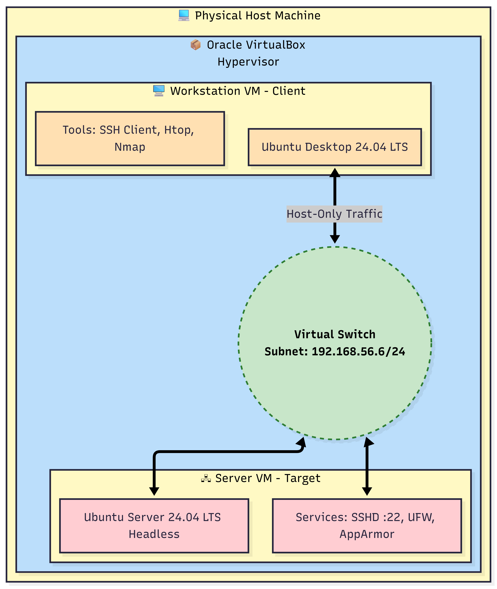

# Week 1: System Planning and Distribution Selection

## 1. Introduction

This week focused on the planning and initial deployment of a dual-system architecture. The primary objective was to establish a secure, isolated environment that simulates a professional cloud infrastructure setup, separating the management plane **Workstation** from the production plane **Headless Server**.

## 2. System Architecture


* High-level System Architecture showing the isolated Host-Only network and dual-VM setup.*

## 3. Distribution Selection & Justification

### Selected Distribution: Ubuntu Server 24.04 LTS (Headless)

I selected **Ubuntu Server 24.04 LTS** for the target system. This choice was made based on a comparative analysis against Debian Stable and Rocky Linux, focusing on three key areas:

#### A. Sustainability & Resource Efficiency

By deploying the **Headless** version without a Graphical User Interface, I significantly reduce the system's resource footprint. Data centres consume approximately 1% of global electricity, and optimized OS configurations can reduce server energy consumption by 15-30%. A headless setup minimizes RAM usage, typically <512MB and CPU cycles compared to a desktop environment, strictly adhering to these sustainability principles.

#### B. Employability & Industry Standards

Ubuntu is a dominant operating system in public cloud infrastructure. Mastering its package management `apt` and service configuration `systemd` is directly relevant to DevOps and Cloud Engineering roles. This choice ensures my learning is aligned with current job market requirements.

#### C. Security Framework
Unlike alternatives like Rocky Linux (which uses SELinux), Ubuntu uses **AppArmor** by default. This provides a robust Mandatory Access Control (MAC) framework that allows for path-based security profiles. This is an industry-standard control that balances security depth with manageable configuration complexity for the 7-week timeframe.

## 4. Workstation Configuration Decision

### Selected Option: Option A (Linux Desktop VM)
I chose to deploy a dedicated **Ubuntu Desktop 24.04 VM** as my administrative workstation.

**Justification:**
1.  **Security Isolation:** Using a dedicated VM for administration ensures that security tools, like `nmap` and `hydra`, are contained within the virtual network. This prevents accidental scanning of the university or home network, strictly adhering to the ethical guidelines.
2.  **Tool Compatibility:** A native Linux workstation allows for seamless SSH key management and scripting. Scripts developed here, e.g., `bash` monitoring scripts will run natively on the server without character encoding issues often found in Windows environments.
3.  **Pedagogical Constraint:** This setup forces 100% reliance on Linux-to-Linux remote administration, mimicking a real-world scenario where a SysAdmin manages remote fleets from a secure jump box.

## 5. Network Configuration Documentation

To ensure a secure and isolated testing environment, I utilized the **VirtualBox Host-Only Adapter**.

| Setting | Configuration | Reason |
| :--- | :--- | :--- |
| **Network Mode** | Host-Only Adapter | Creates an air-gapped network isolated from the internet. Essential for ethical security testing. |
| **Subnet** | `192.168.56.6/24` | Standard private IP range for VirtualBox. |
| **Server IP** | `192.168.56.20` | Static IP assigned via Netplan to ensure consistent SSH access. |
| **Workstation IP** | `192.168.1.10` | Static IP for reliable log analysis and monitoring. |

**Netplan Configuration (Server `00-installer-config.yaml`):**
```yaml
network:
  ethernets:
    enp0s3:
      dhcp4: true          # NAT Adapter for Internet (Updates)
    enp0s8:
      dhcp4: false         # Host-Only Adapter (Internal Network)
      addresses:
        - 192.168.56.6/24
  version: 2
```


## 6. System Specifications (CLI Evidence)

The following command-line outputs confirm the successful deployment of the headless server environment.

#### A. Kernel & Architecture (`uname -a`)

Evidence of a 64-bit Linux kernel running on the target hardware. This verifies the core OS version.

#### B. Memory Usage (`free -h`)

**Analysis:** The system is using minimal RAM (ensure this is <500MB) due to the headless configuration, validating the sustainability justification.

#### C. Disk Usage (`df -h`)

Storage allocation for the root filesystem. This establishes the baseline storage footprint before installing applications.

#### D. IP Address Verification (`ip addr`)

Confirmation that interface enp0s8 has the static IP 192.168.56.20, proving the network configuration was successful.

#### E. Distribution Info (`lsb_release -a`)

Verifies the installation of Ubuntu 24.04 LTS.


## 7. Learning Reflection

Deploying this architecture highlighted the trade-off between convenience and control. While a bridged network would have been easier to set up, it would expose the server to the wider LAN. By choosing the Host-Only network, I prioritized security isolation and ethical compliance, accepting the complexity of managing dual network adapters **NAT for updates + Host-Only for SSH** as a necessary professional trade-off.

---
[← Return to Home](./index.md) | [Next: Week 2 →](./week2.md)


